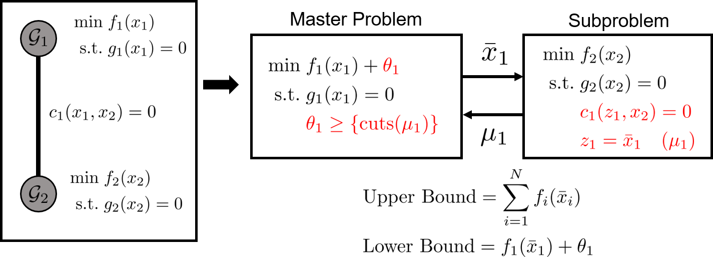

# Solution Algorithm for PlasmoBenders.jl

Benders and Nested Benders Decomposition are iterative algorithms, often used for solving large-scal problems. These algorithms are typically applied to linear programs (LP) and mixed-integer linear programs (MILP). They operate by iteratively solving smaller subproblems and sharing information between these subproblems (typically primal and dual) until an upper and lower bound converge or a different termination criteria is reached. A review of Benders decomposition and its applications can be found [here](https://www.sciencedirect.com/science/article/pii/S0377221716310244), and an example of Nested Benders Decomposition (also referred to as Dual-Dynamic Programming) can be found [here](https://www.sciencedirect.com/science/article/abs/pii/S0098135421000430). This documentation will give an overview of the algorithms, but a full discussion of the algorithms can be found in the preprint on this package available [here]().

## Benders Decomposition
Benders Decomposition (BD) involves decomposing an optimization problem into a master problem and a subproblem(s) and solving these iteratively. The master problem contains a set of complicating variables that, when set, often makes the subproblem(s) easier to solve. The general approach of Benders is to solve the master problem and then to pass the solutions of the master problem to the subproblem(s) and to fix the solution of these variables in the subproblem(s). The subproblem(s) is then solved and information (often dual solutions) from the subproblem(s) is passed back to the master problem and is used to form "cuts" or "cutting planes" on the master problem. These cuts restrict the feasible region of the master problem, and the process is repeated after the cuts are added.

BD is applied to problems of the form 
```math
\begin{align*}
    \min &\; c_1^\top x_1 + c_2^\top x_2 \\
    \textrm{s.t.} &\; A_1 x_1 + A_2 x_2 \le b\\
    &\; C_1 x_1 \le d_1 \\
    &\; C_2 x_2 \le d_2.
\end{align*}
```

Here, the first constraint prevents us from separating this problem into two subproblems. We can solve this problem with BD by creating a master problem and a subproblem. The master problem has the form
```math
\begin{align*}
    \min &\; c_1^\top x_1 + \theta \\
    \textrm{s.t.} &\; C_1 x_1 \le d_1 \\
    &\; \theta \ge \{\textrm{cuts} \}
\end{align*}
```
where $\theta$ is the "cost-to_go" variable, which is an underestimate of the optimal value of the subproblem's optimal solution. The variable $\theta$ is constrained by cuts that are generated at each iteration of the BD algorithm. The subproblem has the form 
```math
\begin{align*}
    \min &\; c_2^\top x_2\\
    \textrm{s.t.} &\; C_2 x_2 \le d_2 \\
    &\; A_1 z + A_2 x_2 \le b \\
    &\; z = \bar{x}_2 \quad (\lambda)
\end{align*}
```
where $\bar{x}$ is the solution of the master problem at the last iteration and $\lambda$ is the dual variable for the corresponding constraint. Note that the constraint $A_1z + A_2x_2 \le b$ is enforced at the subproblem level, which ensures that the solution fo the master problem and subproblem is a feasible solution of the original problem (assuming complete recourse). Since $\theta$ is an underestimate of the optimal value of the subproblem, solving the master problem produces a lower bound on the original problem's solution. Each iteration of the algorithm (assuming complete recourse) results in a feasible solution to the original problem which forms an upper bound on the original optimization problem.

A visualization of BD for graphs is shown below. Here, the graph on the left has two subgraphs with an edge between them. One of the subgraphs can be treated as the "master" problem, and the other as the "subproblem." The cost-to-go variable is added to the master problem along with the cutting plane restrictions. The solutions of the master problem are then fixed in the subproblem. These problems are iteratively solved until a solution is reached. 




## Nested Benders Decomposition
Nested Benders Decomposition (NBD) is similar to BD but includes more than two "stages" of problems. BD can be considered a "two-stage" problem where the master problem is the first stage, which is then linked to a subproblem in a "second" stage. In NBD, There can be additional subproblems, such that the subproblem in stage two can contain complicating variables for an additional subproblem in a third stage, and so forth. This can be visualized as shown below. 


In NBD, there is a "forward-pass" where each stage is solved sequentially and primal solutions are shared to and fixed in the next stage. After each stage has been solved, information can be shared to the previous stage in a "backward-pass" to form cutting planes on each previous stage. 

## Implementation in PlasmoBenders.jl
PlasmoBenders.jl implements the NBD algorithm. BD can be considered a specialized case of NBD, such that we only need to implement a single algorithm in the code. There are many additional parameters and techniques that NBD can include, and these are covered in other pages of the documentation. 
