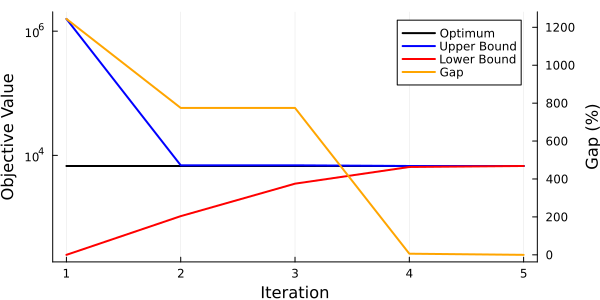

# System Sizing

This example is a simple example highlighting how PlasmoBenders can be applied to solve a problem using Benders Decomposition (BD). 

## Problem Formulation

The example below is a simplified problem where we need to choose the size of a storage system and a reactor. In this problem, we are purchasing a raw material, $x$, that can be converted by a reactor into a product, $y$. There are varying costs for the raw material, and there are varying demands. We can store the raw material near the reactor, but the product must be produced to meet the demand (i.e., we are not storing the product). We have five options of storage size and five options of reactor size to choose from, and the costs are directly related to the size. The mathematical formulation of this problem is given below. 


```math
\begin{align*}
    \min &\; \alpha_{storage} s_{size} + \alpha_{reactor} r_{size} + \sum_{t=1}^T c^{raw}_t x^{buy}_t + \beta y^{unmet}_t\\
    \textrm{s.t.} &\; x^{store}_{t+1} - x^{store}_t = x^{save}_t, \quad t = 1, ..., T-1\\
    &\; y^{product}_t = \gamma (x^{buy}_t - x^{save}_t), \quad t = 1, ..., T\\
    &\; y^{unmet}_t \ge D_t - y^{product}_t, \quad t = 1, ..., T \\
    &\; s_{size} = \sum_{i \in N} z^s_i \lambda^{storage}_i, \quad \sum_{i \in N} z^s_i = 1  \\
    &\; r_{size} = \sum_{i \in N} z^r_i \lambda^{reactor}_i, \quad \sum_{i \in N} z^r_i = 1 \\ 
    &\; 0 \le x^{store}_t \le s_{size}, \quad t = 1, ..., T \\
    &\; 0 \le x^{buy}_t - x^{save}_t \le r_{size}, \quad t = 1, ..., T\\
    &\; 0 \le y^{product}_t \le \overline{d}^{sell}, \quad t = 1, ..., T \\
    &\; \underline{d}^{save} \le x^{save}_t \le \overline{d}^{save}, \quad t = 1, ..., T \\
    &\; x^{store}_1 = \bar{x}^{store}
\end{align*}
```

Here, $x^{buy}_t$ is the amount of raw material purchased at time $t$, $x^{save}$ is the amount of raw material sent to storage (can be negative if it is removed from storage), $y^{product}_t$ is the amount of product created by the reactor to meet the demand, $D_t$, $y^{unmet}_t$ is the unmet demand (which is penalized in the objective), $s_{size}$ is the chosen size of the storage unit, and $r_{size}$ is the chosen size of the reactor. In this problem, we assume that we have $N$ possible storage unit sizes and $N$ possible reactor sizes, represented by $\lambda^{storage}_i$ and $\lambda^{reactor}_i$, respectively. The binary variables $z^s_i$ and $z^r_i$ ensure that the storage and reactor sizes are equal to the available sizes, and we constrain the sum of the binary variables for storage and for the reactor to be equal to one (i.e., only choose one size). The choice of storage unit and reactor size are then upper bounds on the total raw material stored or the amount of raw material sent to the reactor (note that $x^{buy}_t - x^{save}$ is the amount of raw material sent to the reactor). The parameters $\alpha_{storage}$, $\alpha_{reactor}$, $c^{raw}_t$, and $\beta$ relate to the costs of their respective variables. $\gamma$ is a conversion factor of raw material to product. 


## Modeling the Problem with Plasmo

We can model this problem using Plasmo. This problem can be thought of as a _hierarchical optimization problem_ where we must consider a planning decision (storage unit and reactor sizes) that are going to have impacts on an operational level. To handle this, we will create two subgraphs. The first will be a planning-level subgraph containing the storage unit and reactor sizing decisions ($s_{size}$, $r_{size}$, $z^{s}$, and $z^{r}$) and their corresponding constraints. The second will be an operations-level subgraph containing the operation behavior ($x^{buy}_t$, $x^{store}_t$, $x^{save}_t$, $y^{product}_t$, $y^{unmet}_t$). These two layers will be linked by constraints on the lower-level subgraph. We will then treat the planning level OptiGraph as the root graph and use BD to solve this problem. 

First, we will define the cost and demand data we need for this problem. This can be done with the code snippet below: 

```julia 
using Random, Distributions
t = 0:1:30

Random.seed!(10)
cost1 = sin.(x .* 2 .* pi ./ 10 ) .* 2 .+ 10 .+ rand(Uniform(-1,1),31) .* .5
demand1 = sin.(x .* 2 .* pi ./ 15 ) .* 30 .+ 100 .+ rand(Uniform(-1,1),31) .* 5
```

The resulting data can be visualized as shown below: 


Next, we will define the root (planning-level) graph. We add a node to this graph that will contain the storage unit and reactor sizing variables.

```julia
using Plasmo, HiGHS, PlasmoBenders

# Define graph and add a node
g_root = OptiGraph()
@optinode(g_root, n_root)

# Set the possible storage and reactor sizes to choose from
storage_sizes = [10, 50, 100, 500, 1000]
reactor_sizes = [10, 20, 50, 100, 200]

# Define variables for the sizes and define binary variables for choosing sizes
@variable(n_root, storage_size >= 0)
@variable(n_root, reactor_size >= 0)
@variable(n_root, storage_bin[1:5], Bin)
@variable(n_root, reactor_bin[1:5], Bin)

# Ensure that we choose one and only one size
@constraint(n_root, sum(storage_bin) == 1)
@constraint(n_root, sum(reactor_bin) == 1)

# Set the size variables equal to the binary variables times their respective options
@constraint(n_root, storage_size == sum(storage_bin[i] * storage_sizes[i] for i in 1:5))
@constraint(n_root, reactor_size == sum(reactor_bin[i] * reactor_sizes[i] for i in 1:5))

# Set the objective on the node
@objective(n_root, Min, 5 * storage_size + 20 * reactor_size)

# Set the objective on the graph
set_to_node_objectives(g_root)
```

In the code above, we have defined five options for storage sizes ($10$, $50$, $100$, $500$, and $1000$) and five options for reactor sizes ($10$, $20$, $50$, $100$, and $200$). 

We will now also create the operations-level subgraph. We will define a function that takes a cost and demand value input and build the graph via that function (for reasons that will be discussed later).

```julia
function build_scenario_graph(cost, demand, num_scenarios = 1)
    # Define time points
    T = length(cost)
    
    # Define OptiGraph and nodes (one node for each time point)
    g = OptiGraph()
    @optinode(g, n[1:T])

    # Loop through the nodes  and add variables and constraints
    for (t, node) in enumerate(n)

        # Define variables on the nodes
        @variable(node, 0 <= x_buy )
        @variable(node, -50 <= x_save <= 50)
        @variable(node, 0 <= x_store)
        @variable(node, 0 <= y_product)
        @variable(node, 0 <= unmet_demand)

        # Add constraints to the nodes
        @constraint(node, unmet_demand >= demand[t] - y_product)
        @constraint(node, y_product == 5 * (x_buy - x_save))

        # Define objective on the node
        @objective(node, Min, (unmet_demand * 1000 + x_buy * cost[t]) / num_scenarios)
    end

    # Set the initial storage amount
    @constraint(n[1], n[1][:x_store] == 10)

    # Link the storage variables acorss time points
    @linkconstraint(g, [t = 1:(T-1)], n[t + 1][:x_store] - n[t][:x_store] == n[t][:x_save])
    
    # Set graph objective to summation of node objectives
    set_to_node_objectives(g)

    # Return the graph
    return g
end
```

With the above function defined, we can now build a graph from our demand and cost data we defined. We will also define an overall graph `g` that will own the planning- and operations-level subgraphs. 

```julia
# Define overall graph
g = OptiGraph()

# Define operations level subgraph
g1 = build_scenario_graph(cost1, demand1)

# Add subgraphs to graph `g`
add_subgraph!(g, g_root)
add_subgraph!(g, g1)
```

With these graphs created, the last thing to do is to create the linking constraints between the layers. We will force the storage unit and reactor sizes to be upper bounds on their respective variables by defining linking constraints between the two subgraphs. 

```julia
# Define time points
T = length(all_nodes(g1))

# Define constraints on storage and reactor sizes
@linkconstraint(g, [t = 1:T], g1[:n][t][:x_store] <= g_root[:n_root][:storage_size])
@linkconstraint(g, [t = 1:T], g1[:n][t][:x_buy] - g1[:n][t][:x_save] <= g_root[:n_root][:reactor_size])
```

## Solving with PlasmoBenders

The subgraphs of this problem form a tree structure (two subgraphs with edges connecting them), so we can now apply BD via PlasmoBenders. We will create the `BendersAlgorithm` object by calling 

```julia
# Define a subproblem object to use for the subgraphs
solver = optimizer_with_attributes(HiGHS.Optimizer, "output_flag" => false)

# Define the BendersAlgorithm object and set the subproblem solver
benders_alg = BendersAlgorithm(g, g_root, solver = solver)
```

The `BendersAlgorithm` object can now be solved by calling 
```julia
run_algorithm!(benders_alg)
```

The upper and lower bounds and the gap from the BD algorithm are shown below. 



Here, the upper and lower bounds converge after 5 iterations. 

It can help to look at the solutions after each iteration to better understand how the algorithm is operation. At iteration 1, there are no cutting planes, and the root subgraph is solved first (independent of the operations-level). This means that it is _only_ trying to minimize cost by choosing the least expensive options. Therefore, it chooses the smalles storage unit and reactor sizes ($10$ and $10$). This is suboptimal in the operations-level; the cutting plane added after iteration 1 helps iteration 2 reach a better solution. In iteration 2, the root subgraph chooses a storage size of $10$ and a reactor size of $50$. This is a better solution but still suboptimal, and more cutting planes are added. At iteration 3, the root subgraph chooses a storage size of $500$ and a reactor size of $50$. This is actually a worse solution than the previous iteration, and an additional cutting plane is again added. At iteration 4, the root subgraph chooses a storage size of $50$ and a reactor size of $50$. This is in fact the optimal solution. However, we require one more iteration for the lower bound to converge. This is because the solution of the root subgraph yields a lower bound on the overall problem, but this root subgraph requires the cutting plane of the subproblem at iteration 4 before the lower bound converges to the optimal solution. 

## Adding extra scenarios
This problem is relatively basic, but gives an idea of how PlasmoBenders can be applied. We could add complexity to this problem by making it _stochastic_. To do this, we could instead consider sizing the storage unit and the reactor size under different scenarios. We will create different demand and cost data and create subgraphs for each of these. In addition, we have to divide each scenario by the number of scenarios (this is assuming each scenario is equally likely, so this is just multiplying by each scenario's probability).

```julia
# Define two new scenarios of demand and costs
cost2 = sin.(x .* 2 .* pi ./ 10 ) .* 2 .+ 15 .+ rand(Uniform(-1,1),31) .* .75
demand2 = sin.(x .* 2 .* pi ./ 15 ) .* 30 .+ 90 .+ rand(Uniform(-1,1),31) .* 4.5

cost3 = sin.(x .* 2 .* pi ./ 10 ) .* 2 .+ 8 .+ rand(Uniform(-1,1),31) .* .4
demand3 = sin.(x .* 2 .* pi ./ 15 ) .* 30 .+ 80 .+ rand(Uniform(-1,1),31) .* 4

# Define overall graph
g = OptiGraph()

# Define subgraphs for each scenario
g1 = build_scenario_graph(cost1, demand1, 3)
g2 = build_scenario_graph(cost2, demand2, 3)
g3 = build_scenario_graph(cost3, demand3, 3)

# Add subgraphs to the original graph
add_subgraph!(g, g_root)
add_subgraph!(g, g1)
add_subgraph!(g, g2)
add_subgraph!(g, g3)
```

With these new subgraphs defined, we need to link the variables to the root graph. 
```julia
# Link variables of scenario 2 to root graph
@linkconstraint(g, [t = 1:T], g2[:n][t][:x_store] <= g_root[:n_root][:storage_size])
@linkconstraint(g, [t = 1:T], g2[:n][t][:x_buy] - g2[:n][t][:x_save] <= g_root[:n_root][:reactor_size])

# Link variables of scneario 3 to root graph
@linkconstraint(g, [t = 1:T], g3[:n][t][:x_store] <= g_root[:n_root][:storage_size])
@linkconstraint(g, [t = 1:T], g3[:n][t][:x_buy] - g3[:n][t][:x_save] <= g_root[:n_root][:reactor_size])
```

We can now call the `BendersAlgorithm` function and solve this problem as before. In addition, if desired, we could set additional solver options, such as `multicut = false` (this uses one extra iteration) or `regularize = true` (which decreases the number of required iterations by 1). 

!!! note
    PlasmoBenders currently does not create a copy of the graph that is passed to the optimizer. This means that the graph `g` can't be altered with adding `g2` and `g3` after the original `BendersAlgorithm` object is created. Instead, a new graph must be created and a new `BendersAlgorithm` object must be formed for running the stochastic case above. 