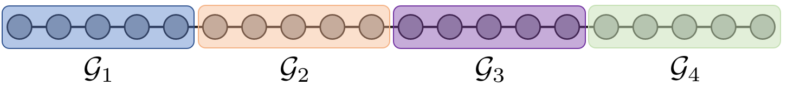
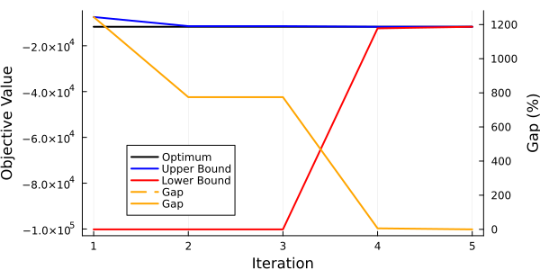

# Storage Operation

This example is a simple example highlighting how PlasmoBenders can be applied to solve a temporal problem using Nested Benders Decomposition (Dual Dynamic Programming).

## Problem Formulation

The example below is a simplified storage operation problem, where a raw material can be purchased and converted to a product and sold. The price of the product is variable, so it is most economical to store the product at times of low price and sell at times of high price. This problem can be considered a "multi-scale" problem because it is making decisions at each time point while having to consider longer-term product prices. The mathematical problem is as follows: 

```math
\begin{align*}
    \min &\; \sum_{t=1}^T c^{raw}_t u^{raw}_t - c^{sell}_t x^{sell}_t \\
    \textrm{s.t.} &\; x^{store}_{t+1} - x^{store}_t = x^{save}_t, \quad t = 1, ..., T-1\\
    &\; x^{save}_t + x^{sell}_t - \alpha \cdot  u_t^{raw} = 0, \quad t = 1, ..., T \\
    &\; 0 \le x^{store}_t \le \overline{d}^{store}, \quad t = 1, ..., T \\
    &\; 0 \le x^{sell}_t \le \overline{d}^{sell}, \quad t = 1, ..., T \\
    &\; \underline{d}^{save} \le x^{save}_t \le \overline{d}^{save}, \quad t = 1, ..., T \\
    &\; x^{store}_1 = \bar{x}^{store}
\end{align*}
```

Here, $\underline{d}$ and $\overline{d}$ are the upper and lower bounds on their respective variables, $x^{store}_t$ is the amount of product in storage at time $t$, $x^{save}_t$ is the amount of product sent to storage (can be negative), $x^{sell}_t$ is the amount of product sold, $u^{raw}_t$ is the amount of raw material purchased, $c^{sell}_t$ is the price for product at time $t$, $c^{raw}$ is the (constant) cost of raw material purchased, and $\alpha$ is a conversion factor from raw material to product. The first constraint is a mass balance on the storage, so that $x^{save}_t$ represents the change in storage at time $t$. The second constraint is a mass balance on product at time $t$, which ensures that any product generated ($\alpha u^{raw}_t$) must either be sold or sent to storage. 

## Modeling the Problem with Plasmo

This problem can be modeled as a linear graph using Plasmo. We will represent each time point as a node in the graph, with $T = 20$ total nodes.  The code for building this problem is shown below: 

```julia
using Plasmo, HiGHS, PlasmoBenders

# Set problem data
N = 20
x_price = fill(5, N); u_cost = fill(20, N)
x_price[6:10] .= 20; x_price[16:20] .= 50

# Define OptiGraph and ndoes
graph = OptiGraph()
@optinode(graph, nodes[1:N])

# Fill each node with variables and constraints
for (j, node) in enumerate(nodes)
    @variable(node, 0 <= x_storage <= 100)
    @variable(node, 0 <= x_sell <= 50)
    @variable(node, -20 <= x_save <= 20)
    @variable(node, 0 <= u <= 25)

    @constraint(node, x_save + x_sell - 2 * u == 0)
    @objective(node, Min, -x_sell * x_price[j] + u * u_cost[j])
end

# Set initial storage value
@constraint(nodes[1], nodes[1][:x_storage] == 10)

# Define linking constraints for storage
@linkconstraint(graph, [i = 1:(N - 1)], nodes[i + 1][:x_storage] - nodes[i][:x_storage] == nodes[i][:x_save])
```
The above problem results in the following shape: 


This problem is a simple LP and could be solved directly with a LP solver. However, we will solve this problem using Nested Benders Decomposition to highlight how the decomposition scheme works. We will partition this problem into four subproblems, each with five nodes. This can be done with the code below:

```julia 
node_membership_vector = zeros(Int, N)
node_membership_vector[1:5]   .= 1
node_membership_vector[6:10]  .= 2
node_membership_vector[11:15] .= 3
node_membership_vector[16:20] .= 4

partition = Plasmo.Partition(graph, node_membership_vector)

apply_partition!(graph, partition)

for subgraph in local_subgraphs(graph)
    set_to_node_objectives(subgraph)
end
```

The resulting problem can be visualized as: 



## Solving with PlasmoBenders

The subgraphs have a (linear) tree structure, so we can pass this graph to PlasmoBenders' `BendersAlgorithm` constructor and solve it with Nested Benders Decomposition. This also requires setting a "root subgraph." We will set the first subgraph as the root subgraph, but any of the subgraphs could be used. 

```julia
solver = optimizer_with_attributes(HiGHS.Optimizer, "output_flag" => false)

root_graph = local_subgraphs(graph)[1]
benders_alg = BendersAlgorithm(graph, root_graph, solver = solver)
```

The Nested Benders scheme is able to reach the optimal solution after 5 iterations. The bounds and gap are shown below.



Note that the first iteration returns an upper bound that is well above the optimal. The first iteration of the solve is performing a "receding-horizon" approach, where each subgraph is solved in series and the optimal solution passed to the next subgraph. This results in a sub optimal solution since each problem is not "seeing" the future prices of the product. The cutting planes that are formed after each iteration essentially help provide the previous subgraphs with knowledge of how their solution impacts the solution of future subproblems, which results in the upper bound eventually converging to the true solution. 

## Querying Solutions

PlasmoBenders provides access to API functions for querying the optimal solution from the BendersAlgorithm object. We can query the solution by calling 
```julia
JuMP.objective_value(benders_alg)
```
which returns the best upper bound. We can query the lower bound by calling
```julia
JuMP.dual_objective_value(benders_alg)
```
This lower bound can be less than the upper bound for MIP problems since there can be a duality gap. We can also query the relative gap by calling
```julia
relative_gap(benders_alg)
```
Individual variable values can be retrieved by calling
```julia
JuMP.value(benders_alg, graph[:nodes][1][:x_sell])
```
In addition, `JuMP.value` has been extended to also take a vector of variables rather than just a single variable, so we can also call
```julia
JuMP.value(benders_alg, all_variables(graph))
```
